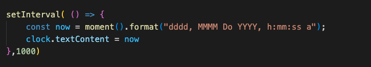
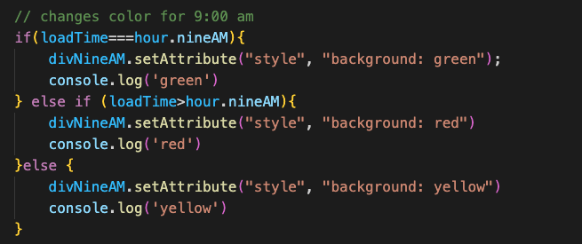

## Table of Contents
* [Title](*Title)
* [Introduction](*Introduction)
* [Technologies](*Technologies)
* [Set-up](*Set-up)
* [What-was-accomplished](*What-was-accomplished)
# Timed - Quiz
## Introduction

This project is a calendar application which will save text, organize the event by current time , and display the current date and time.

## Techonologies
Project is created with:
*HTML5
*CSS6
*JavaScript
*JQuerry
*Momant.js
*Bootstrap
## Set-up
To run, you can either clone the repo and run or go to via browser [https://grant-ellington.github.io/PasswordGenerator/](https://grant-ellington.github.io/PasswordGenerator/)
## What was accomplished
* Using bootrap- created a css front end with flexiblen design.
* I continously up-dating clock.
* A calendar which udates background color based on time of loading
* A claendar spots which incorporates local storage to store important events.

### Features

#### Bootstrap

Bootsrap was used for the the front text area the col numbers determine the proportions of each row.

#### Continous Clock

The continous clock uses a interval timer set to one second to update via the moment.js time every second. 

### Color Coding

The color coding works by changing the css property via the html style tag with the specific values set to numbers and the laodTime vaiable set on the pge load with the current hour. 

### Saving using localStorage

This app saves text data via the textarea and then adding it to the local storage via the save Button . The doc then reads the loal storage and displays the previous textarea. To cahnge you can simply eddit the area and save.

